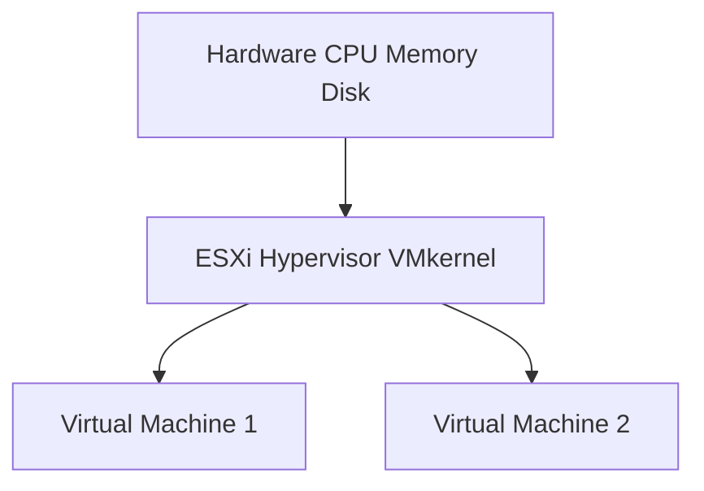
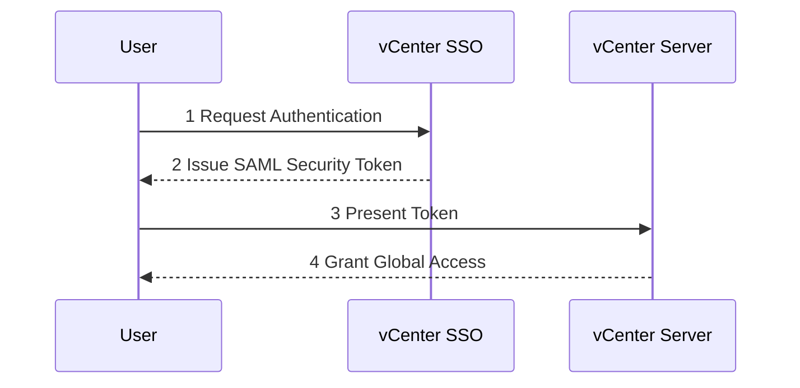
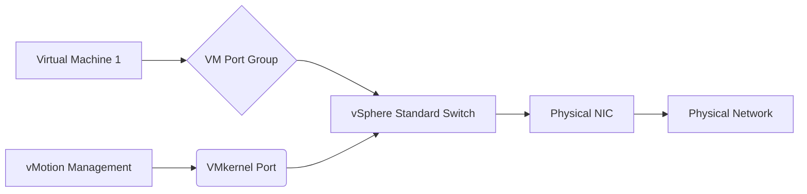
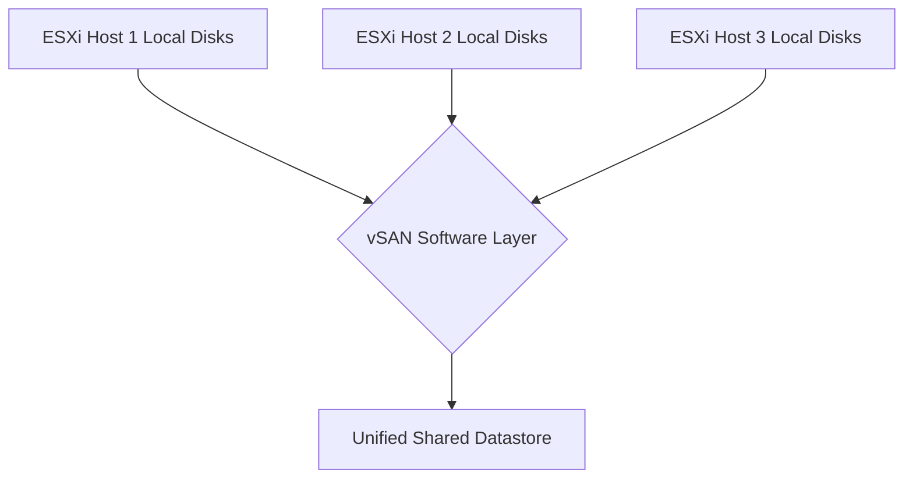
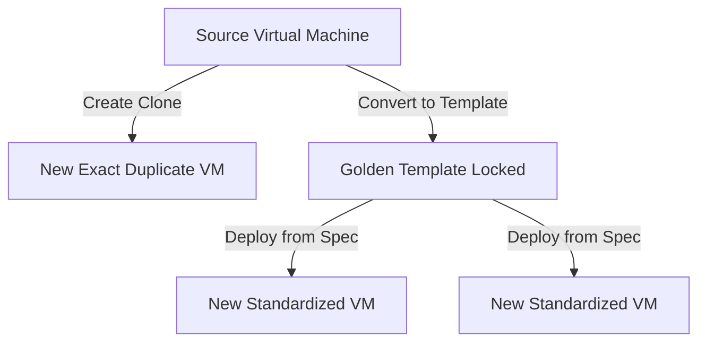
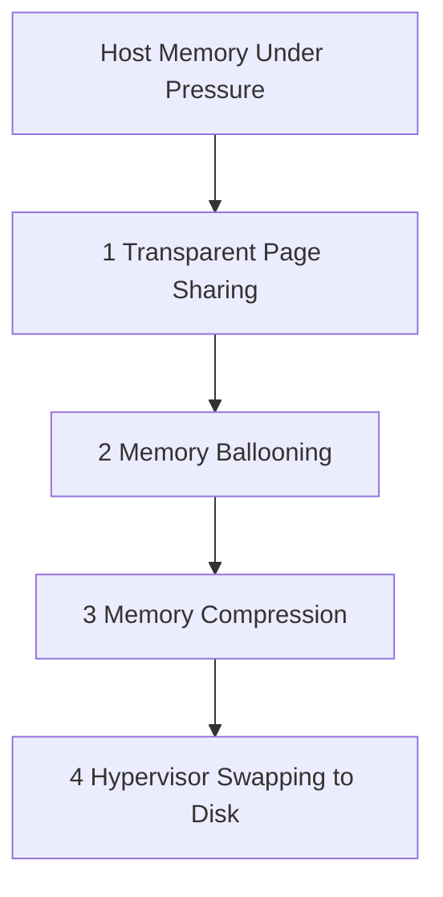
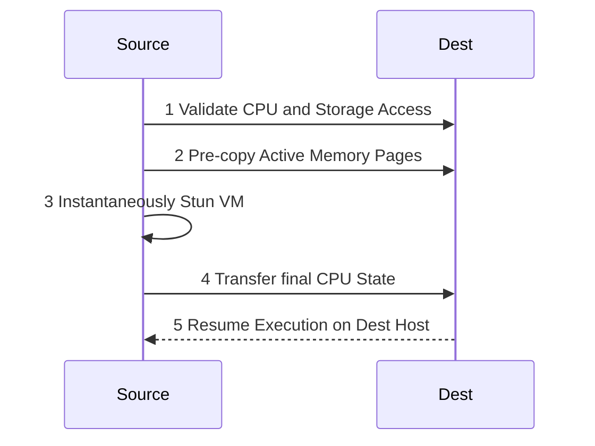
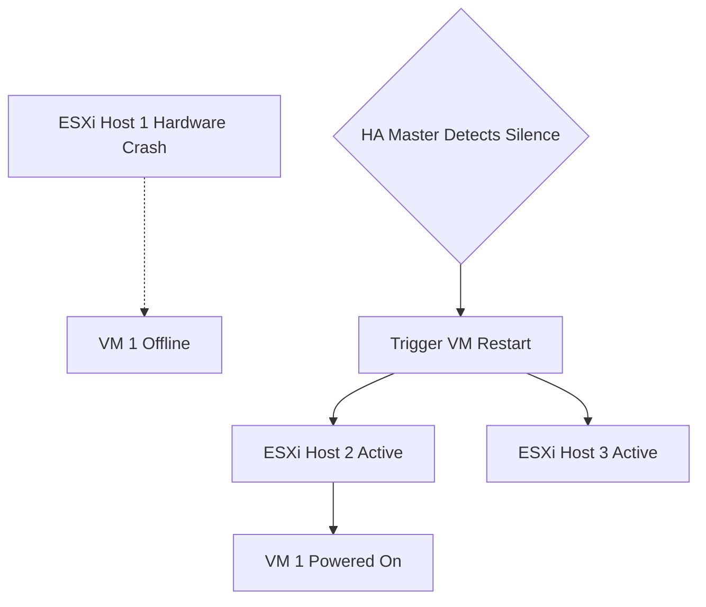

# Server Virtualization (VMware vSphere 6.7) - 10-Mark Detailed Q&A

This guide is designed to guarantee full marks on **10-mark** or **Long Answer** exam questions. It combines rapid-fire definitions with extreme depth and provides simple, syntax-safe diagrams for every major topic.

---

### Unit I: Introducing & Installing ESXi/vCenter

**Q1: Define VMware ESXi and explain its core architecture. (Probability: 95%)**
**A:**
*   **Definition of ESXi:** A robust, bare-metal (Type 1) hypervisor that is installed directly on a physical server's motherboard, bypassing the need for a general-purpose host OS entirely.
*   **The VMkernel:** This is the proprietary micro-operating-system at the core of ESXi. It is solely responsible for resource scheduling, managing hardware locks, and routing virtual requests to physical CPU/RAM.
*   **Hardware Partitioning:** It fundamentally slices physical resources into completely isolated, independent virtual "sandboxes" called Virtual Machines (VMs).
*   **Zero OS Dependency:** Because there is no underlying Windows or Linux host OS, the hypervisor's attack surface is drastically reduced and performance is maximized.
*   **Direct Console User Interface (DCUI):** A minimalist, text-based yellow/grey physical screen used exclusively to configure the absolute base settings of the host (e.g., Management IP, DNS, Root Password).

**Diagram: Bare-Metal Type-1 Architecture**

**Keywords:** Bare-metal, Type 1 Hypervisor, VMkernel, DCUI, Hardware Abstraction.

**Q2: Explain vCenter Single Sign-On (SSO) and vSphere Auto Deploy. (Probability: 80%)**
**A:**
*   **vCenter Server Definition:** The master, centralized administrative utility that manages a fleet of hundreds of ESXi hosts natively.
*   **SSO Definition:** An internal security broker/authentication system natively running within the Platform Services Controller (PSC). Its default domain is usually `vsphere.local`.
*   **Token-Exchange Mechanism:** Instead of logging into every single ESXi host manually, SSO allows an admin to log in once. SSO issues a cryptographic "SAML Token", which is used seamlessly to authenticate against the entire vCenter infrastructure.
*   **Auto Deploy Definition:** A hyper-efficient architecture designed to deploy ESXi onto thousands of bare-metal servers.
*   **Stateless Booting:** Physical servers boot over the network using PXE/TFTP without executing from a local hard drive. The ESXi image profile is streamed rapidly and reliably directly into RAM. 

**Diagram: SSO Token Flow**

**Keywords:** SAML Token, PSC, vsphere.local, PXE Boot, Stateless.

---

### Unit II: Networking, Storage, HA & Security

**Q3: Contrast Virtual Switches with Physical Switches and define VMkernel Ports. (Probability: 95%)**
**A:**
*   **Virtual Switch (vSS) Definition:** A totally software-constructed Layer-2 switch existing strictly inside the memory of the hypervisor. 
*   **No Hardware Topology Limits:** vSwitches are engineered to be logically foolproof—they cannot loop packets back to themselves, which completely eliminates the need for Spanning Tree Protocol (STP).
*   **MAC Address Awareness:** While a physical switch dynamically *learns* MAC addresses from traffic, a Virtual Switch already inherently *knows* the MAC address of every virtual adapter plugged into it.
*   **Physical Uplinks (vmnics):** The physical network cables/cards sticking out of the back of the bare-metal server. vSwitches use them to bridge outgoing virtual traffic onto the physical LAN.
*   **VMkernel Port Definition:** A separate, highly specialized logical routing port designed solely for the hypervisor's system traffic. It handles intensive backend traffic like Live vMotion, connection to remote iSCSI/NFS Storage, and Fault Tolerance data logging.

**Diagram: Virtual Switch Hierarchy**

**Keywords:** Software Layer 2, No STP, Port Group, Physical Uplinks, Management/vMotion Traffic.

**Q4: Compare Shared vs. Local Storage and define VMware vSAN. (Probability: 90%)**
**A:**
*   **Local Storage Concept (DAS):** High-speed hard drives plugged directly into the physical ESXi server chassis. It is fast but heavily limits clustering.
*   **Shared Storage Concept (SAN/NAS):** A master array on a dedicated storage network (Fibre Channel or iSCSI) accessible simultaneously by every single ESXi host in a cluster.
*   **The Shared Requirement:** Advanced enterprise features like High Availability (HA) and vMotion strictly mandate Shared Storage. Without it, the VMs cannot be passed dynamically between hosts.
*   **Definition of vSAN:** VMware’s proprietary Software-Defined Storage (SDS).
*   **vSAN Architecture:** vSAN radically alters legacy deployment by taking the *local* directly-attached disks of all ESXi hosts and mathematically pooling them over the network into a single, massively resilient shared datastore block.

**Diagram: vSAN Architecture**

**Keywords:** DAS vs SAN, Shared Requirement Array, SDS, Local Disk Pooling.

---

### Unit III: Managing VMs and Resource Allocation

**Q5: Compare VM Clones and Templates, and explain OVF. (Probability: 90%)**
**A:**
*   **Clone Definition:** A flawless 1:1 replica of a specific Virtual Machine (including data, OS state, and exact MAC addresses). Commonly used as a quick, disposable copy for testing destructive patches before hitting real production lines.
*   **Template Definition:** A read-only, locked "Golden Master" baseline image explicitly meant for mass-deployment, ensuring that every new machine spun up adheres to extreme compliance and standard corporate builds.
*   **Customization Specification:** Because you cannot deploy 10 clones with the exact same IP and serial numbers, a "Customization Spec" injects a unique Computer Name, IP, and a freshly generated Windows SID during the template deployment.
*   **OVF Definition:** The Open Virtualization Format creates compressed, highly portable archives (packaging .vmdk disks and XML descriptors together), allowing an admin to download a virtual appliance off the internet and instantly import it.

**Diagram: Clones vs Templates**

**Keywords:** Golden Master Baseline, Customization Spec, SID Injection, OVF Packaging.

**Q6: Explain ESXi Advanced Memory Management and TPS. (Probability: 95%)**
**A:**
*   **Memory Overcommitment Definition:** The act of assigning 128GB of Virtual RAM to VMs when the physical hardware motherboard only has 64GB of RAM installed. This is safely managed by the VMkernel's 4-tier memory reclamation hierarchy.
*   **Tier 1 - TPS (Transparent Page Sharing):** A native memory deduplication technology. It scans physical RAM globally, instantly zeroes out duplicate operating system memory blocks (e.g., 10 VMs running identical Windows core binaries), and points the VMs to a single master physical block.
*   **Tier 2 - Memory Ballooning:** By issuing a command via the VMware Tools driver (`vmmemctl`), the hypervisor digitally inflates a "balloon" inside the guest OS. This forcefully tricks the guest into using its own internal page file, thereby surrendering huge blocks of RAM back to the hypervisor.
*   **Tier 3 - Memory Compression:** Zips under-utilized memory pages to drastically reduce physical cluster consumption footprint.
*   **Tier 4 - Swapping:** The total last resort. The hypervisor directly dumps remaining VM RAM to physical spinning disks, causing profound interface lag. 

**Diagram: 4-Tier Memory Reclamation Strategy**

**Keywords:** Overcommitment, Deduplication, Ballooning driver, Compression, Last Resort Swapping.

---

### Unit IV: Balancing Utilization & Performance

**Q7: Deep-Dive into vMotion and Storage vMotion capabilities. (Probability: 100%)**
**A:**
*   **vMotion Definition:** A revolutionary protocol allowing the seamless live-migration of a running Virtual Machine's active compute container (CPU/Memory state) across disparate physical ESXi hosts without a single second of dropped user packets or network downtime.
*   **Hard Requirements:** Absolute necessity of a dedicated high-bandwidth VMkernel network block, tightly matching physical CPU families (or masking via EVC Mode), and identical Shared Datastore access.
*   **Memory Pre-Copy Phase:** The hypervisor essentially streams all active, changing memory pages block-by-block across the encrypted virtual network to the destination chassis *before* making the final leap.
*   **Storage vMotion Definition:** Where standard vMotion moves *compute*, Storage vMotion moves the actual underlying hard disk geometries (.vmdk files) across physical SAN/NAS datastores continuously in the background, without powering down the VM.
*   **Cross-vCenter vMotion:** Elevates capability enabling workload boundary crossing between physically independent clusters, disparate data-centers, and entirely separate vCenter server domains.

**Diagram: vMotion Pre-Copy Workflow**

**Keywords:** Live Migration State, Zero Downtime, Pre-copy sequence, EVC CPU Match, Storage File Movement.

---

**Q8: Explain vSphere High Availability (HA) and Fault Tolerance (FT) mechanisms. (Probability: 95%)**
**A:**
*   **vSphere HA Definition:** A clustering feature that pools ESXi hosts together. If a physical host's hardware burns out, vSphere HA automatically detects the failure and instantly reboots the affected VMs on surviving hosts in the cluster.
*   **Heartbeat Network:** HA elects a "Master" host that constantly pings "Slave" hosts over the management VMkernel network. If no pings return, the host is declared dead.
*   **Datastore Heartbeating:** A secondary backup check; if the management network fails but the host is still writing to the shared SAN datastore, HA knows the host is alive but isolated.
*   **Windows Server Failover Clustering:** A complementary application-level HA. While vSphere HA protects against hardware failure, Windows Clustering protects against software crashes operating gracefully inside the VM.
*   **Network Load Balancing (NLB):** Distributes incoming web traffic evenly across identically configured VMs to prevent severe network bottlenecks on a single node.

**Diagram: vSphere HA Failover**

**Keywords:** Heartbeating, Master/Slave, Datastore Heartbeat, Automatic Restart, Windows Failover.

**Q9: What is vSphere Update Manager (VUM) and ESXi Security? (Probability: 80%)**
**A:**
*   **VUM Definition:** A centralized automated patching entity integrated directly into vCenter. It is the sole mechanism used to safely upgrade ESXi hosts, Virtual Appliances, and VMware Tools.
*   **Baselines:** An admin creates a "Baseline" (e.g., "Critical Patches 2024"). VUM scans the ESXi hosts against this baseline to find out which hosts are fundamentally non-compliant or outdated.
*   **Remediation:** The automated act of fixing compliance. VUM places the host into Maintenance Mode (using vMotion to evacuate all VMs), installs the patches, reboots the server, and brings it back online independently.
*   **ESXi Security (RBAC):** Role-Based Access Control completely eliminates shared "root" passwords. You assign individual AD Users to structural Roles, and apply them securely to Objects.
*   **Lockdown Mode:** Forces the ESXi host to exclusively accept management commands strictly through vCenter Server, immediately shutting out the local direct console (DCUI) and SSH access.

**Keywords:** Baselines, Remediation, Maintenance Mode, RBAC, Lockdown Mode, Patch Automation.

**Q10: Explain Performance Monitoring, Alarms, and PowerCLI Automation. (Probability: 85%)**
**A:**
*   **vCenter Alarms:** Highly configurable state-based notifications. If a VM's CPU usage spikes over 95% for exactly 5 minutes, an alarm triggers a warning or critical red structural flag.
*   **Alarm Actions:** Beyond sending emails or SNMP traps, an alarm can execute automated actions (e.g., instantly suspending the VM or forcefully rebooting the underlying guest OS).
*   **Performance Charts:** vCenter provides intensive granular metrics mapping realtime or historical utilization of highly specific resources (CPU Ready Time, RAM Active, Disk Latency).
*   **PowerCLI Automation:** An incredibly robust enterprise automation engine consisting of hundreds of custom cmdlets engineered natively on top of Microsoft PowerShell.
*   **Use Case:** Instead of clicking through GUI wizards 800 times, a simple 4-line PowerCLI script can completely configure networking, storage, and deploy 800 templates across 10 clusters simultaneously.

**Keywords:** State-based Alarms, SNMP Traps, Historical Metrics, PowerCLI, Custom Cmdlets, Mass Automation.

---

### The Exam "Fallback Para" (Guaranteed Partial Points for Long Answers)
*(If you are stuck on a generic 10-mark essay question, combining these 5 structural points will historically prove immense command over Server Virtualization architecture, usually scraping significant grading partials).*

> **Structural Fillers for Exam Answers:**
> *   **Hardware Abstraction Protocol:** Hypervisors like ESXi seamlessly decouple the physical hardware limits (CPU, RAM, Storage throughput) entirely away from the strict operating system execution layers.
> *   **Utmost Isolation Matrix:** By provisioning VMs in totally independent execution sandboxes, catastrophic failures or viral attacks inside one server boundary will categorically never cross-contaminate surrounding environments.
> *   **Maximizing Datacenter Utilization:** It economically transforms legacy physical systems running at an abysmal 15% CPU load into highly-converged structural machines effortlessly floating at 85%+ processing capacity.
> *   **High Availability (HA) Failovers:** Centralized vCenter infrastructures dynamically construct heartbeat pools ensuring VMs instantly reboot on surviving network blades when a physical motherboard catastrophically crashes.
> *   **Decreasing Green CapEx/OpEx:** Datacenter virtualization radically depreciates physical server chassis sprawl, drastically cutting rack space limits, cooling mechanics, electricity limits, and administrative payroll overheads.

---

### The "Go Blank" Master Keyword Bank
*(If you completely forget how to structure your answer, weaving these specific technical vocabulary words into a standard sentence will heavily signal to the grader that you understand the material. Memorize these!)*

#### 1. Core Compute / Hypervisor Keywords:
> `Bare-metal`,  `Hardware Abstraction`, `Microkernel (VMkernel)`, `Resource Partitioning`, `Execution Isolation`, `Type 1 Hypervisor`, `Centralized Management (vCenter)`, `SAML Token Authentication`.

#### 2. Virtual Networking & Storage Keywords:
> `Layer 2 Software Switch (vSS)`, `Spanning Tree Protocol (STP) Elimination`, `VMkernel Routing Port`, `Logical Port Groups`, `Shared Datastore Architecture`, `Direct Attached Storage (DAS)`, `Storage Area Network (SAN)`, `Software-Defined Storage (vSAN)`.

#### 3. Migration, Reliability & Availability Keywords:
> `Live vMotion Migration`, `Zero-Downtime Compute Transfer`, `Stateful Memory Pre-Copy`, `Storage vMotion (VMDK transfer)`, `High Availability (HA) Clustering`, `Datastore Heartbeating`, `Business Continuity`, `Network Load Balancing (NLB)`.

#### 4. Automation & Scalability Keywords:
> `Golden Master Templates`, `Customization Specifications (Sysprep/SID)`, `Stateless Auto Deploy`, `Role-Based Access Control (RBAC)`, `Maintenance Mode Evacuation`, `vSphere Update Manager (VUM)`, `PowerCLI Cmdlets`.
