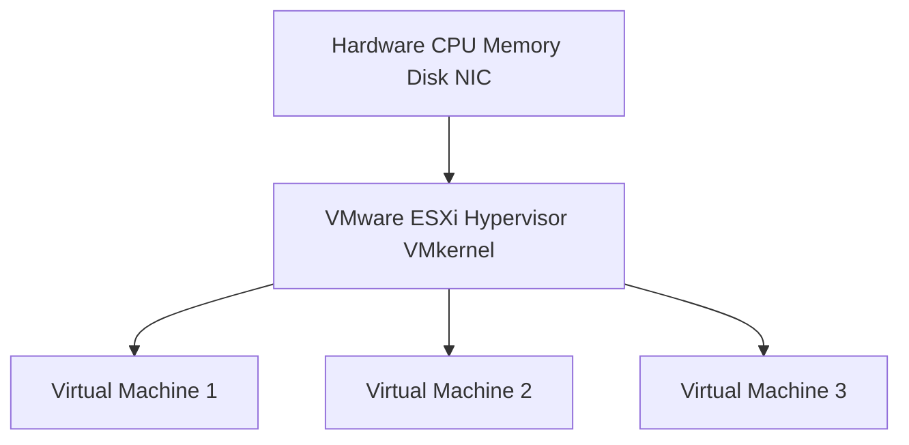
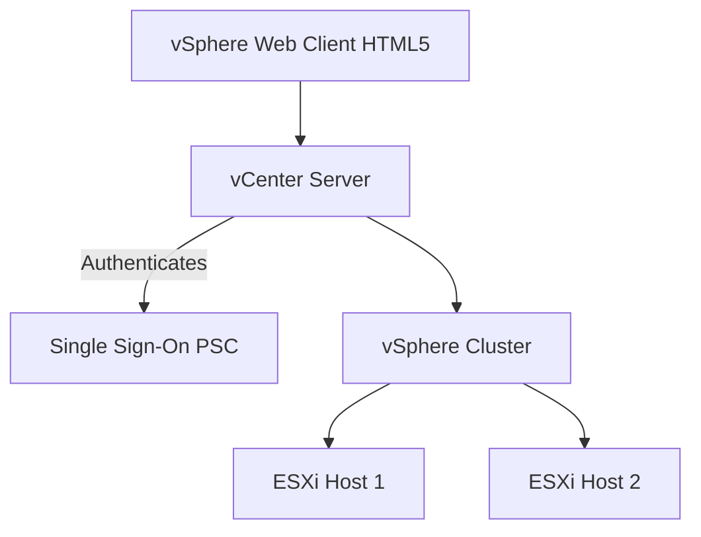
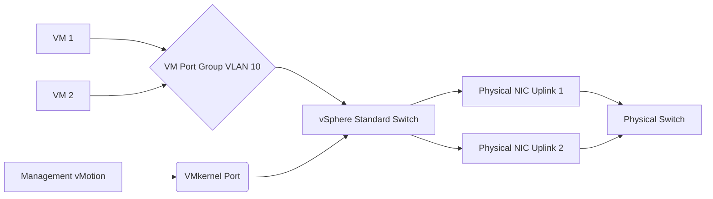
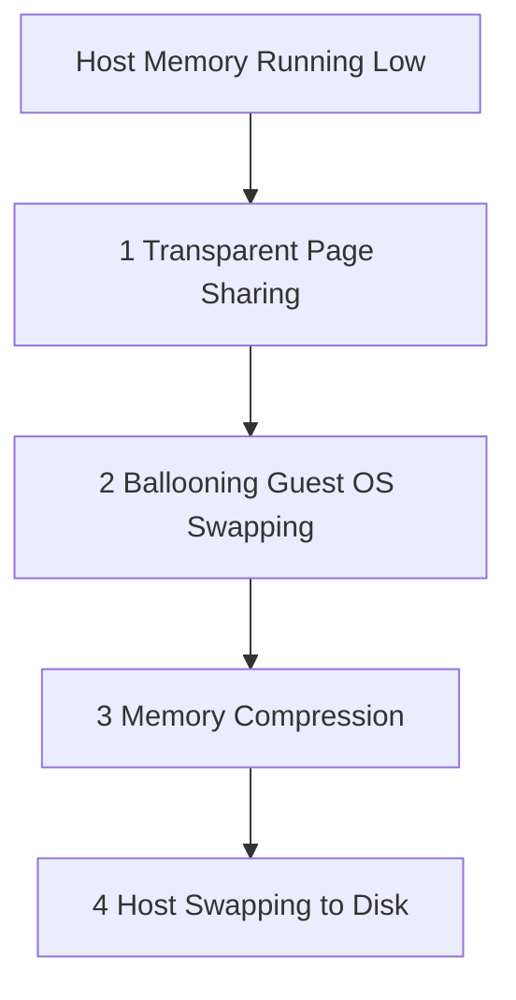
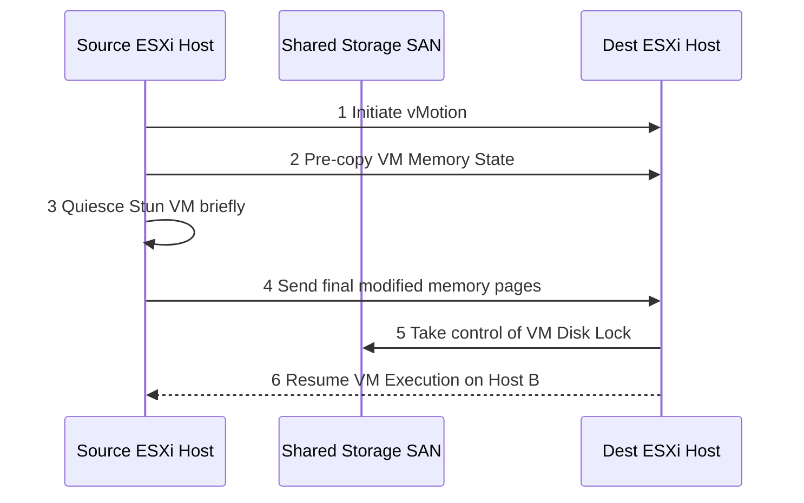
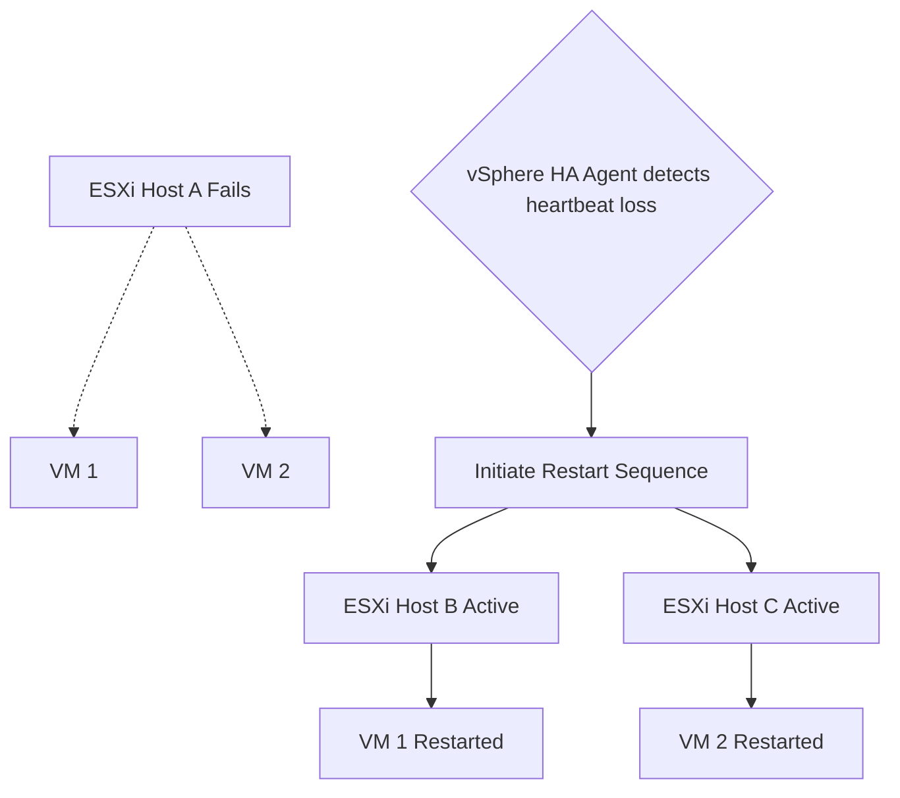

# Server Virtualization (VMware vSphere 6.7) - In-Depth Definitions & Diagrams

This guide provides comprehensive definitions and conceptual diagrams for the core topics in your VMware vSphere 6.7 syllabus. Each section includes an estimated exam probability based on standard virtualization curricula.

---

## 1. ESXi Hypervisor Architecture (Probability: 95%)
**Definition:** 
VMware ESXi is a robust, bare-metal (Type 1) hypervisor that installs directly onto physical server hardware. Unlike Type 2 hypervisors, it operates independently of a host operating system, which greatly reduces its footprint, maximizes hardware resource utilization, and enhances security. ESXi partitions the physical hardware into isolated, secure virtual machines.

**Core Components:**
*   **VMkernel:** The core operating system of the hypervisor. It controls the underlying physical hardware and manages the allocation of resources to the VMs.
*   **Direct Console User Interface (DCUI):** The physical console of the ESXi host used for basic initial configuration (networking, passwords).
*   **Host Client:** An HTML5-based web interface connected directly to the ESXi host for single-host management.

**Diagram: Bare-Metal Architecture**

---

## 2. vCenter Server & Platform Services Controller (Probability: 85%)
**Definition:** 
VMware vCenter Server is a centralized management utility for VMware vSphere. It acts as the central administrator for ESXi hosts interconnected entirely on a network. The **Platform Services Controller (PSC)** is a critical component that manages infrastructure security functions such as vCenter Single Sign-On (SSO), licensing, and certificate management.

**Deployment Models:**
In vSphere 6.7, PSC can be deployed as *Embedded* (PSC and vCenter on the same VM) or *External* (PSC on a separate VM feeding multiple vCenters).

**Diagram: vCenter and ESXi Relationship**

---

## 3. vSphere Virtual Networking (Probability: 95%)
**Definition:** 
Virtual networking allows VMs to communicate with each other and the outside physical world. A **vSphere Standard Switch (vSS)** operates like a Layer-2 physical switch inside the hypervisor.

**Key Components:**
*   **Physical Uplinks (vmnic):** The physical network adapters on the ESXi host that connect the virtual switch to the physical network.
*   **Virtual Machine Port Group:** A grouping of virtual ports with specific configuration (like VLAN tagging) used to connect VM network traffic.
*   **VMkernel Port:** A specialized port used by the ESXi host itself for system traffic (Management, vMotion, IP Storage, fault tolerance).

**Diagram: Virtual Switch Components**

---

## 4. Advanced Memory Technologies in ESXi (Probability: 100%)
**Definition:** 
ESXi utilizes highly advanced memory management techniques to allow "Memory Overcommitment" (allocating more RAM to VMs than physically exists on the host). When memory runs low, the hypervisor reclaims memory in four distinct stages:

1.  **Transparent Page Sharing (TPS):** Deduplicates identical memory pages across VMs (e.g., multiple VMs running the exact same version of Windows).
2.  **Memory Ballooning:** Uses the VMware Tools driver (vmmemctl) inside the VM to force the guest OS to page its own idle memory to the guest disk, returning RAM to the hypervisor.
3.  **Memory Compression:** Compresses memory pages that cannot be ballooned, taking up less physical space.
4.  **Hypervisor Swapping:** The absolute last resort. The hypervisor directly writes VM memory pages to a `.vswp` file on the physical storage array. Very slow performance.

**Diagram: Memory Reclamation Hierarchy**

---

## 5. vMotion & Storage vMotion (Probability: 95%)
**Definition:** 
**vMotion** is the zero-downtime live migration of a running Virtual Machine from one physical ESXi host to another. **Storage vMotion** is the live migration of a Virtual Machine's disk files (VMDKs) from one datastore to another, while the VM remains running.

**Requirements for vMotion:**
*   Shared storage between hosts (i.e. SAN or NAS).
*   Gigabit or higher dedicated VMkernel network for vMotion traffic.
*   Matching CPU compatibility between source and destination hosts (or EVC Mode enabled).

**Diagram: Live vMotion Migration**

---

## 6. vSphere High Availability & Business Continuity (Probability: 85%)
**Definition:**
**vSphere HA** provides high availability for virtual machines by pooling them and the hosts they reside on into a cluster. If an ESXi host experiences a hardware failure, vSphere HA automatically restarts the victim VMs on other surviving ESXi hosts in the cluster.

**Diagram: vSphere HA Process**

